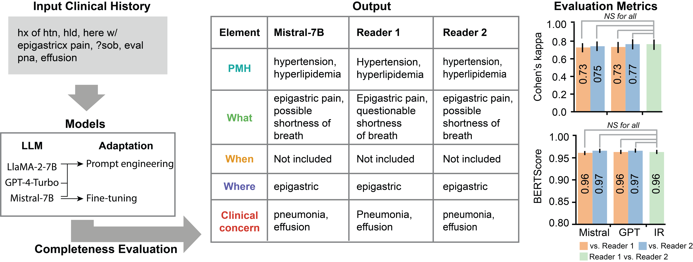

 // Start of Selection
# Clinical History Evaluation

Official Implementation by the Stanford AI Development and Evaluation Lab

- **Title:** Assessing the Completeness of Clinical Histories Accompanying Imaging Orders using Open- and Closed-Source Large Language Models
- **Authors:** David Larson, [Arogya Koirala](mailto:arogya@stanford.edu), Lina Chuey, Magdalini Paschali, Dave Van Veen, Hye Sun Na, Matthew Petterson, Zhongnan Fang, Akshay S. Chaudhari
- **Contact:** arogya@stanford.edu




## 1. Overview

This repository contains code for evaluating the completeness of clinical histories using large language models. The system analyzes clinical text and extracts key components including:

- Past Medical History (PMH): aspects of medical history relevant to the clinical scenario
- What: relevant signs and symptoms prompting the imaging request
- When: time course of inciting event
- Where: localization (if applicable)
- Clinical Concern: diagnostic entities that referring clinician wants to be evaluated

## 2. Setup

### 2.1 Conda Environment
Create and activate conda environment

```bash
conda create -n clinical-history-eval python=3.10
conda activate clinical-history-eval
conda install pip
pip install -e .
```

### 2.2 Hugging Face Authentication
This project uses models from Hugging Face Hub. You'll need to authenticate to access them:

1. Create a Hugging Face account at [https://huggingface.co/](https://huggingface.co/)
2. Generate an access token at [https://huggingface.co/settings/tokens](https://huggingface.co/settings/tokens)
3. Install huggingface-cli: `pip install huggingface-cli`
4. Login using: `huggingface-cli login`

## 3. Dataset

This repository includes a development dataset of 125 synthetic clinical histories located in the `data` folder. These histories were generated using GPT-4 and are provided for development and testing purposes only. Important notes about the dataset:

- The synthetic histories do not reflect actual clinical observations or real patient data
- They likely contain errors and have not been validated by clinical professionals
- They should not be used for clinical decision making or research conclusions 
- Users should replace this data with properly sourced clinical histories from their own institution when using this code for research or clinical applications

The synthetic dataset is provided solely to demonstrate the functionality of the code and enable initial testing. For any meaningful application, users should obtain and use appropriate clinical data following their institution's protocols and ethical guidelines.

## 4. Usage

### 4.1 Inference
Run inference on clinical histories using pre-trained models to extract key components.

#### 4.1.1 Single Text Inference
Process a single clinical history text and output structured components.

```python
python inference.py \
    --text="Relevant PMH ESRD. Presents with L foot gangrene for a duration of 3 weeks. Specific location of issue (if applicable): 2nd digit of L foot. Concern for gangrene." \
    --output-dir="test_output"
```

#### 4.1.2 Batch Inference from CSV
Process multiple clinical histories from a CSV file in batch mode.
```python
python inference.py \
    --csv="path/to/input.csv" \
    --output-dir="test_output"
```

#### 4.1.3 In-Context Learning (ICL)
Enable dynamic example selection to improve inference quality using similar cases.

Add these flags to enable ICL:
```python
--use-icl \
--icl-data="path/to/examples.csv" \
--n-icl-examples=16 \
--index-path="test_output/faiss_index"
```

### 4.2 Finetuning
Adapt the model to your specific use case or dataset through additional training.

#### 4.2.1 Basic Finetuning
Simple finetuning configuration for quick model adaptation.

```python
python finetuning.py \
    --train-data="path/to/train.csv" \
    --val-data="path/to/val.csv" \
    --output-dir="finetuning_output" \
    --batch-size=4 \
    --epochs=3
```

#### 4.2.2 Advanced Finetuning Options
Extended configuration options for more control over the training process.

```python
python finetuning.py \
    --train-data="path/to/train.csv" \
    --val-data="path/to/val.csv" \
    --output-dir="finetuning_output" \
    --base-model="mistralai/Mistral-7B-v0.1" \
    --batch-size=4 \
    --grad-accum=4 \
    --lr=2e-4 \
    --epochs=3 \
    --lora-r=64 \
    --lora-alpha=128 \
    --lora-dropout=0.05 \
    --load-in-8bit
```

## 5. Key Parameters

### 5.1 Inference Parameters
- `--base-model`: Base model to use (default: mistralai/Mistral-7B-v0.1)
- `--peft-model`: PEFT model path (default: akoirala/clinical-history-eval)
- `--max-length`: Maximum length for generated text (default: 500)
- `--temperature`: Temperature for text generation (default: 0.7)
- `--device`: Device to use (cuda/cpu/auto)
- `--load-in-8bit`: Enable 8-bit quantization
- `--load-in-4bit`: Enable 4-bit quantization
- `--use-flash-attention`: Enable flash attention when available

### 5.2 Finetuning Parameters
- `--train-data`: Path to training data CSV (required)
- `--val-data`: Path to validation data CSV (optional)
- `--template`: Path to Jinja template file (default: template.jinja)
- `--batch-size`: Training batch size (default: 4)
- `--grad-accum`: Gradient accumulation steps (default: 4)
- `--lr`: Learning rate (default: 2e-4)
- `--epochs`: Number of epochs (default: 3)
- `--lora-r`: LoRA attention dimension (default: 64)
- `--lora-alpha`: LoRA alpha parameter (default: 128)
- `--lora-dropout`: LoRA dropout value (default: 0.05)


## 6. Using Slurm

Both inference and finetuning scripts can be run using Slurm. Example usage:

```bash
# For inference
sbatch -c 8 --gres=gpu:l40:1 --time=0 slurm.sh \
    --module=inference \
    --csv=path/to/input.csv \
    --output-dir=test_output

# For finetuning
sbatch -c 8 --gres=gpu:l40:1 --time=12:00:00 slurm.sh \
    --module=finetuning \
    --train-data=path/to/train.csv \
    --val-data=path/to/val.csv \
    --output-dir=finetuning_output
```

## 7. Output Format

Results are saved as JSON files in the specified output directory:
```json
{
  "status": "success",
  "input_prompt": "...",
  "generated_text": "...",
  "parsed_output": {
    "pmh": "...",
    "what": "...",
    "when": "...",
    "where": "...",
    "cf": "..."
  },
  "inference_stats": {
    "time_seconds": 1.23,
    "device": "cuda:0",
    "timestamp": "2024-03-21 10:30:45"
  }
}
```

## 8. Contributing

Please feel free to open issues or submit pull requests. For major changes, please open an issue first to discuss what you would like to change.

## 9. Citation

If you find this work useful in your research, please consider citing:

```bibtex
@article{larson2024assessing,
    title={Assessing the Completeness of Clinical Histories Accompanying Imaging Orders using Open- and Closed-Source Large Language Models},
    author={Larson, David and Koirala, Arogya and Chuey, Lina and Paschali, Magdalini and Van Veen, Dave and Na, Hye Sun and Petterson, Matthew and Fang, Zhongnan and Chaudhari, Akshay S.},
    journal={arXiv preprint},
    year={2024}
}
```

## 10. License

This project is licensed under the MIT License - see the [LICENSE](LICENSE) file for details.


sbatch -c 8 --gres=gpu:l40:1 --time=2:00:00 slurm.sh     --module=evaluation     --test-data=data/test.csv     --peft-model=/dataNAS/people/arogya/projects/clinical-history-eval/outputs/training --output-dir=outputs/evaluation


sbatch -c 8 --gres=gpu:l40:1 --time=2:00:00 slurm.sh     --module=evaluation     --test-data=data/test.csv      --output-dir=outputs/evaluation